# Migration Playbook: Struts/JSP/JDBC &rarr; FastAPI/SQLAlchemy/React

This document maps every layer of `legacy-java` to its counterpart in
`modernized-python`, and explains *why* each mapping was made that way. It's
written the way I'd write a migration proposal for a client: concrete,
layer-by-layer, with the trade-offs stated rather than glossed over.

Both halves implement the exact same domain (purchase orders: customers,
products, line items, a bulk-discount rule, tax calculation, and a
draft &rarr; submitted &rarr; approved/rejected workflow) so they can be
compared directly. See [Proof of behavioral parity](#proof-of-behavioral-parity)
for the numbers.

## Architectural Migration Flow

```mermaid
graph TD
    subgraph Legacy ["Legacy (Struts/JSP/JDBC)"]
        L_JSP[JSP Pages / JSTL Templates] -->|HTTP POST .do| L_Servlet[Struts ActionServlet]
        L_Servlet -->|struts-config.xml| L_Action[Struts Action Class]
        L_Action -->|Populate & Validate| L_Form[ActionForm]
        L_Action -->|Execute Business Logic| L_Service[OrderService POJO]
        L_Service -->|JDBC SQL Queries| L_DAO[DAO Classes]
        L_DAO -->|Plain JDBC Connection| L_DB[(H2 Database / Oracle)]
    end

    subgraph Modernized ["Modernized (FastAPI/React/Postgres)"]
        M_React[React SPA Client] -->|Fetch JSON REST API| M_Router[FastAPI APIRouter]
        M_Router -->|Validate Request Body| M_Pydantic[Pydantic Schemas]
        M_Router -->|Execute Rules & Services| M_Service[Order Service Python]
        M_Service -->|ORM Transactions| M_SQLA[SQLAlchemy Models]
        M_SQLA -->|Database Session| M_DB[(PostgreSQL / SQLite)]
    end

    style Legacy fill:#f9d5d5,stroke:#333,stroke-width:1px
    style Modernized fill:#d5f9d5,stroke:#333,stroke-width:1px
```

## Side-by-side map

| Concern | Legacy (`legacy-java`) | Modernized (`modernized-python`) |
|---|---|---|
| Front controller | `web.xml` + Struts `ActionServlet` (`*.do` routes dispatched via `struts-config.xml`) | FastAPI app + `APIRouter`s (`app/routers/*.py`) |
| Request handling | `Action` subclasses (`ListOrdersAction`, `ViewOrderAction`, ...), one class per operation | Route handler functions in `app/routers/orders.py` |
| Input binding & validation | `ActionForm` subclasses (`NewOrderForm`, `LineItemForm`) populated by the servlet from request parameters | Pydantic models (`CreateOrderRequest`, `AddLineItemRequest`) in `app/schemas.py` |
| Business logic | `OrderService` (plain POJO, modeled on an EJB session bean's separation from the web/persistence tiers — see the note in that class and in `legacy-java/pom.xml` about not standing up a full Java EE app server for this demo) | `app/services/order_service.py` |
| Persistence | `*Dao` classes (`PurchaseOrderDao`, `ProductDao`, ...) over raw JDBC + hand-written SQL, against Oracle in production | SQLAlchemy ORM models (`app/models.py`) + `Session` queries, against PostgreSQL in production |
| Views | JSP + JSTL (`orders/list.jsp`, `orders/view.jsp`, ...), server-rendered per request | React components (`OrderList.jsx`, `OrderDetail.jsx`, ...), client-rendered against the JSON API |
| Session/config | `ConnectionManager` (hard-coded JDBC URL) | `app/database.py`, configured via `DATABASE_URL` env var (`.env.example`) |
| Tests | None (see the top-level README) | `pytest` suite, 11 tests, run against an in-memory SQLite database |

**Why, layer by layer:**

- **Front controller.** Struts' XML-configured action mappings become
  Python decorators; the routing *concept* (path &rarr; handler) is
  identical, just declared in code instead of XML.
- **Request handling.** Struts required a full class (with a fixed
  `execute(...)` signature) per action. FastAPI collapses this to a plain
  function; less ceremony, same responsibility (parse request &rarr; call
  service &rarr; pick a response).
- **Input binding & validation.** Struts forms only bind/type-coerce; extra
  validation was hand-written in the Action or Service. Pydantic does
  binding, type coercion, *and* validation declaratively, and also
  generates the response schema (`PurchaseOrderOut`) that powers FastAPI's
  auto-generated OpenAPI docs at `/docs` — Struts had no equivalent.
- **Business logic.** This is the layer that matters most for a correct
  migration: the bulk-discount rule, tax calculation, and status-transition
  guards were ported rule-for-rule, including the rounding mode
  (`BigDecimal.setScale(2, RoundingMode.HALF_UP)` &rarr;
  `Decimal.quantize(Decimal("0.01"), rounding=ROUND_HALF_UP)`), specifically
  so the two systems produce byte-for-byte identical output for the same
  input. A migration that "mostly" reproduces the business rules is a
  liability; this is the layer you port first and verify hardest.
- **Persistence.** The legacy DAOs are straight JDBC: explicit
  `PreparedStatement`s, manual `ResultSet` mapping, manual connection
  lifecycle. SQLAlchemy replaces that boilerplate with declarative models
  and relationships (`order.line_items`, `order.customer_name`) — the same
  data, considerably less plumbing to maintain.
- **Views.** This is the most visible change but the least risky one:
  JSP's `<c:forEach>`/`<c:if>` and React's `.map()`/conditional rendering
  are doing the same job (loop over data, branch on state). The API
  boundary these views sit behind (`GET /orders`, `POST
  /orders/{id}/line-items`, ...) mirrors the Struts action paths
  (`orders.do`, `addLineItem.do`) one for one.
- **Session/config.** Externalizing config is one of the easiest wins in a
  migration and was deliberately *not* back-ported to the legacy side, so
  the "before" stays an honest snapshot of what a decade-old internal app
  usually looks like.
- **Tests.** Covered below under [What's better, concretely](#whats-better-concretely).

## Proof of behavioral parity

The scenario: customer "Acme Retail Corp" orders 12 units of a $12.50
product (quantity &ge; 10 triggers the bulk discount) and 2 units of an
$89.99 product (below the threshold, no discount).

Both systems, run independently, produce:

| | Legacy (verified live via curl against Tomcat) | Modernized (verified via `pytest` + live `uvicorn`) |
|---|---|---|
| Subtotal | $329.98 | $329.98 |
| Discount | $15.00 | $15.00 |
| Tax (8%) | $25.20 | $25.20 |
| **Total** | **$340.18** | **$340.18** |

The Python test asserting this is
[`test_order_totals_match_legacy_reference`](modernized-python/backend/tests/test_orders.py).
This is the artifact that should give a client confidence in a migration:
not "we rewrote it and it looks right," but "here is a test that encodes
the legacy system's actual output, and the new system reproduces it."

## What's better, concretely

Being specific instead of just asserting "the new stack is better":

- **Automated tests.** `legacy-java` has none — this is typical of the era
  and codebases it represents, not a criticism specific to this app. The
  business-rule tests on the modernized side (bulk discount, tax, every
  status-transition guard rail) didn't exist before this migration and now
  regression-protect the exact rules a client's revenue depends on.
- **Config externalization.** Connection strings, CORS origins, etc. come
  from environment variables, not hard-coded values buried in a Java class.
- **Auto-generated API docs.** FastAPI serves interactive OpenAPI docs at
  `/docs` for free, from the same Pydantic schemas that validate requests —
  nothing to hand-maintain.
- **Less boilerplate per feature.** Adding a new order operation on the
  legacy side means a new `Action` class + `ActionForm` (if it takes input)
  + `struts-config.xml` entry + JSP. On the modernized side it's a router
  function + a Pydantic schema (only if the shape is new).

## What this migration deliberately did *not* change

- **The business rules themselves.** A modernization project's first
  obligation is behavioral parity — see above. Rule changes are a separate,
  explicitly-scoped conversation with the client, not something that rides
  along silently inside a stack migration.
- **The domain model's shape.** Same four entities, same relationships,
  same status workflow. Migrations that also redesign the domain at the
  same time make it impossible to tell, when something breaks, whether the
  cause was the technology change or the design change.

## How this would actually run as a client engagement

Real migrations of a live system don't stop the world and cut over in one
step. The realistic path, in order:

1. **Characterize the legacy behavior with tests** (what this repo does
   with the parity test above) before writing a line of new code.
2. **Stand up the new stack against the same database** (or a replicated
   copy) so both systems can run side by side against real data.
3. **Migrate read paths first** (order list/detail) behind a feature flag
   or reverse proxy rule, since read paths are lower-risk than writes.
4. **Migrate write paths** (create/submit/approve) once reads have been
   stable in production for a observation period, with the legacy write
   path kept as a fallback.
5. **Decommission the legacy app** only after the new system has handled a
   full business cycle (e.g. a full month-end close, if that's relevant to
   the domain) with no discrepancies.

This repo intentionally stops at step 1-2 (both systems built, both
verified, parity proven) since a full strangler-fig cutover needs a real
production environment and real traffic to be meaningful rather than
theatrical.
